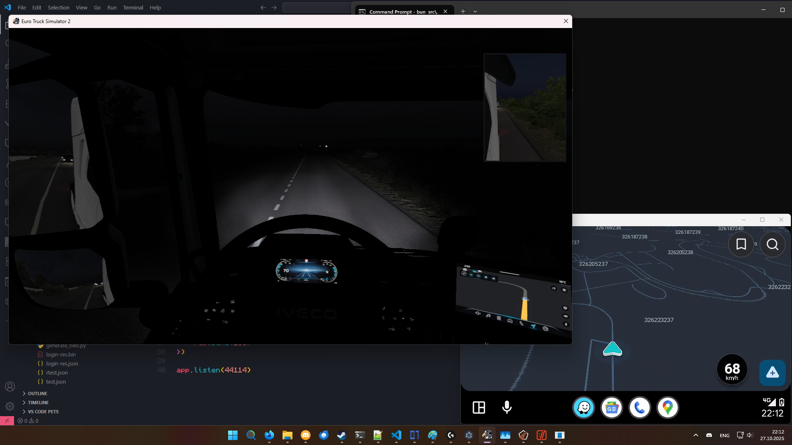
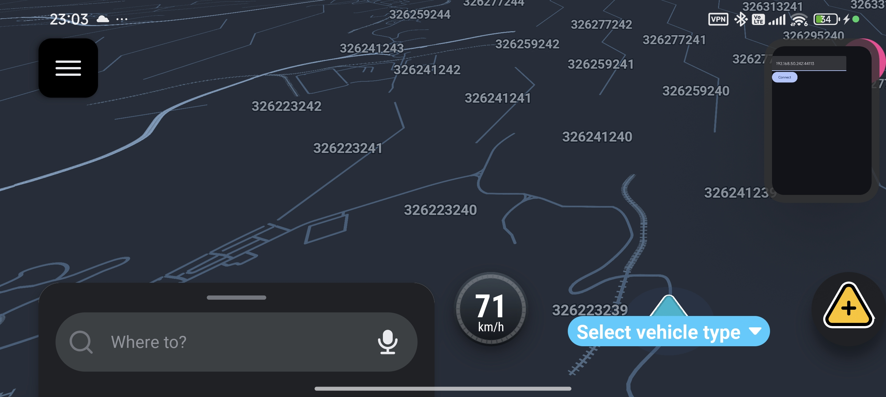

# OwO What's this? :3

a rev eng project regarding [waze's](https://www.waze.com/) tile map formats

more specifically, some scripts that help parse and create new tiles for waze using geojson (mainly aiming to bring Waze into ETS2, sorta)

# Stwuctwue :<zero-width space>P

- `/hexpats` contains hexpat files for use in apps like [ImHex](https://imhex.werwolv.net/) to understand waze tile files
- `/protos` contains the protobuf files used by waze (for proper server faking)
- `/scripts` contains python scripts regarding the processing of waze tile files (WZM/MAP_PKG/RDM, WZDF, WZT)
- `/src` contains server-related TS code. also contains a few tests, and the some intermediate scripts

# How do i use thwis? >w<

- generate a geojson file using [truckermudgeon's lovely map parser/generator](https://github.com/truckermudgeon/maps)
- shove it into `/src/scaleGeoJSON.ts` to scale it down to size (ETS2 uses maps 1:19 at scale)
- run `/src/parseGeoJSON.ts` to generate a json file representing the data to be converted into waze tiles
- then you can either
    - run `/src/index.ts` and have it generate the tiles on the fly
    - run `/src/generate_tiles.py` and have it generate tiles ahead of time
- note, tiles are often cached in the app after receiving them, so generating on the fly isnt slow

# Statuwus? :<zero-width space>o

### waze server
- [x] serve the initial login stuff
- [x] serve tiles
- [ ] handle alert data
- [ ] handle beacon data
- [ ] handle searches
- [ ] handle routes
- [ ] handle much more stuff

### waze tile rev progress
- [x] splitting of map packages
- [x] decompressing waze data files (WZDF)
- [x] parsing wzt
    - [x] entry count
    - [ ] mask bits
    - [x] offsets
    - [x] string arrays
    - [ ] shape data
    - [x] line data
    - [ ] line summary
    - [ ] "broken"
    - [ ] line round about
    - [x] point data
    - [x] point id
    - [ ] line route
        - [x] from_flags
        - [x] to_flags
        - [ ] from_turn_flags
        - [ ] to_turn_flags
    - [x] street name
    - [x] street city
    - [ ] polygon head
        - [x] first_polygon_point_idx 
        - [x] polygon_point_count 
        - [x] name 
        - [x] cfcc 
        - [ ] north 
        - [ ] west 
        - [ ] east 
        - [ ] south 
    - [x] polygon point
    - [ ] line ref
    - [ ] line speed average
    - [ ] line speed id
    - [ ] line speed id small
    - [ ] range
    - [ ] alert data
    - [x] square data
    - [x] metadata attribute
    - [ ] venue head
    - [ ] venue id
    - [x] line ext type
    - [x] line ext id
    - [x] line ext level by line
    - [x] line ext level
    - [ ] line speed max
    - [ ] polygon ex
    - [ ] line attribute
    - [ ] street id
    - [ ] beacon pos
    - [ ] beacon id
    - [ ] beacon ex pos
    - [ ] beacon ex id
    - [ ] beacon ex mask
    - [ ] lane type
    - [ ] line new type
    - [ ] ext protobuf data
- [x] creating a new tile from own data

# i have qwuestion!

### Why a separate script for parsing the geojson?
- python is stupidly slow at parsing json and looping through objects

### Why python and TS?
- python is simple enough to use for parsing the binary files themselves (although i do plan to write a rust lib EVENTUALLY, once i finish understanding the format) but too slow for most operations
- typescript is sth im super familiar with already, but i dont wanna deal with `Uint8Array`s, trust me.

### Generating the tiles manually with a python script seems slow!
- only cause i didnt get to create a server-client approach yet, so the giant-ass json file that results from `parseGeoJSON.ts` takes forever to process and is reprocessed PER tile. multiply that by 20x (because thats how many tiles are by default in a map_pkg request) and yeah

### Wtf is going on with `AA_test.ts` and `redirector_test.ts`???
- i initially wanted to use [ETS2LA's](https://github.com/ETS2LA/Euro-Truck-Simulator-2-Lane-Assist) navigation sockets but for some reason theyre broken on my machine, so i just edited the nav sockets to instead use http posts to a hardcoded link lol
- `AA_test.ts` uses [Google's DHU](https://developer.android.com/training/cars/testing/dhu) to load android auto automatically with (almost) all sensors enabled, and set the location via the headunit itself
- `redirector_test.ts` uses a custom app i made in 2 minutes which uses a TCP socket to send over location data, and mock the location directly on device

### How do i even connect my waze to ur shit
- use sth like [httptoolkit](https://httptoolkit.com/) to redirect `rt.waze.com` and `ctilesgcs-row.waze.com` to your server
- works on both root and non-root devices because you can easily [add the cert settings thing](https://httptoolkit.com/docs/guides/android/#intercepting-traffic-from-your-own-android-app) to waze since it thankfully doesnt use pairip (god bless :pray:)
- you could also just replace `rt.waze.com` and `ctilesgcs-row.waze.com` in the app sourcecode to your own server if thats what you'd like

### My waze crashes when i do that / Says i dont have internet connection
- restart the app until it wants to work
- still unsure whether this is a problem with my server impl (`index.ts`) or with HTTPToolkit
- u could also try clearing storage a few times, its kinda rng honestly

### Does doing X work??
- check [status](#statuwus-o)

# Extwa data rwegawding WZT UwU

| id | data                         |
|----|------------------------------|
| 1  | freeway                      |
| 2  | major highway                |
| 3  | minor highway / boulevard    |
| 4  | ramp                         |
| 5  | primary street               |
| 6  | passage way(?)               |
| 7  | street                       |
| 8  | non-routable pedestrian path |
| 9  | dirt path                    |
| 10 | routable pedestrian path     |
| 11 | stairway                     |
| 12 | railway                      |
| 13 | runway / taxiway             |
| 14 | ferry                        |
| 15 | private road                 |
| 16 | parking lot road             |

note: editor ids dont match with internal waze ids for some goddamn reason, so dont try to get them from the web editor. use those

| cfcc | polygon category              |
|------|-------------------------------|
| 12   | park                          |
| 15   | building / venue              |
| 16   | city / tile (the entire tile) |
| 20   | water                         |

note: there may be more polygon categories than this

| offset | string usage       |
|--------|--------------------|
| 0      | street type        |
| 1      | street base name   |
| 2      |                    |
| 3      | street prefix name |
| 4      | street suffix name |
| 5      | city name          |
| 6      | metadata           |
| 7      | venue name         |

| id | alert type      |
|----|-----------------|
| 2  | speed cam       |
| 3  | dummy speed cam |
| 4  | red light cam   |
| 5  |                 |

note: these alert type things are taken from the old code, and may not be correct

a tile has a size of 10000x10000, which represents 0.01x0.01 (deg lat x deg lon). its (0,0) position is in the bottom left corner

tile_id is calculated via a simple formula from latitude, longitude, and scale. check the scripts to find out how (im too lazy to copy paste)

no idea why streets seem slimmer than they normally are on the map, but it might also be because they lack most data lol

routing seems painful to even THINK about starting. Check [UserDriveV2.proto](./protos/v2/UserDriveV2.proto) (StartNavigationInfo), and just try to understand it lmfao. i mean, its not hard to understand, but oh my god the amount of calculations that seem to be required... ill do it eventually™

# scweenshot!

# much thx to <<zero-width space>3
- [waze](https://waze.com/) for existing in the first place
- [truckermudgeon](https://github.com/truckermudgeon) for his lovely map generation scripts
- [mkoloberdin](https://github.com/mkoloberdin) for keeping a clone of waze's old source code